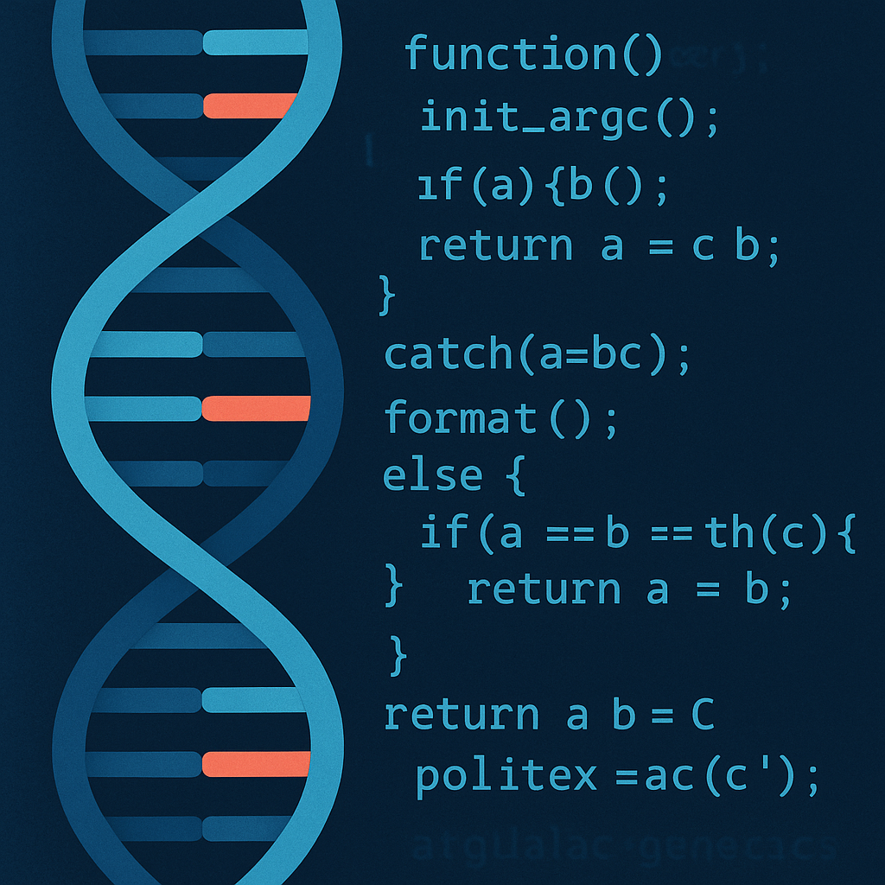

*The future of medicine will belong to those who can read both molecules and code.*

## A vision for blending biology and computation

From the moment I was introduced to biochemistry, I knew I wanted to push deeper into the molecular puzzles that define human health. Yet, as my coursework in computer science unfolded, I also discovered the power of algorithms and software to make sense of complexity at a scale far beyond what the human brain can process. These two passions—biochemical genetics and software engineering—felt like separate worlds at first, but I have come to see them as deeply complementary. My goal is to become a **clinical biochemical geneticist** and fuse that role with my training in computer science to develop new ways of diagnosing and managing genetic diseases.  

## What a clinical biochemical geneticist does

A clinical biochemical geneticist is not just a scientist in a lab coat. They are highly trained professionals (M.D., D.O., or Ph.D.) who direct and interpret biochemical analyses to diagnose and treat genetic disorders. They supervise diagnostic labs, ensure compliance with regulatory standards, and maintain rigorous quality control. They also consult with clinicians and patients, translating raw biochemical data into actionable medical insights. What excites me about this role is its **intersection of research and human care**: the ability to apply advanced biochemical techniques while keeping the patient’s story at the center of the work.  

## Where computer science fits in

The future of genetics is inseparable from computation. Biochemical labs generate massive amounts of data—enzymatic assays, metabolomic profiles, sequencing reads—that can only be interpreted efficiently with computational tools. As a student of computer science, I want to build software that streamlines diagnostic pipelines, integrates biochemical and genomic data, and leverages machine learning to uncover patterns invisible to manual analysis. Just as importantly, I want to ensure that these tools are not black boxes: they should communicate results clearly to clinicians and patients, echoing the geneticist’s responsibility for effective communication.  

## Why I want to combine these fields

To me, pursuing biochemical genetics without computation would be like trying to read a book with half the pages missing. Conversely, applying computer science without grounding it in biology risks building elegant algorithms with little real-world impact. By combining both, I hope to **push the field toward faster, more accurate, and more accessible genetic diagnostics**. Imagine software that instantly cross-references a patient’s biochemical assay results with global databases, or visualization tools that allow clinicians to “see” a metabolic pathway breaking down in real time. This is where I want to contribute: at the interface of computation and medicine, where innovation directly improves human lives.  

## Moving forward

The path toward this career is challenging. It will require doctoral-level training in genetics and biochemistry, rigorous immersion in clinical lab operations, and continued growth in software engineering. But the challenge excites me. The technical complexity, the human impact, and the potential for innovation make this intersection a place where I can see myself not just working, but thriving. My vision is clear: to become a **clinical biochemical geneticist who codes**, bridging two disciplines to shape the future of genetic medicine.  
