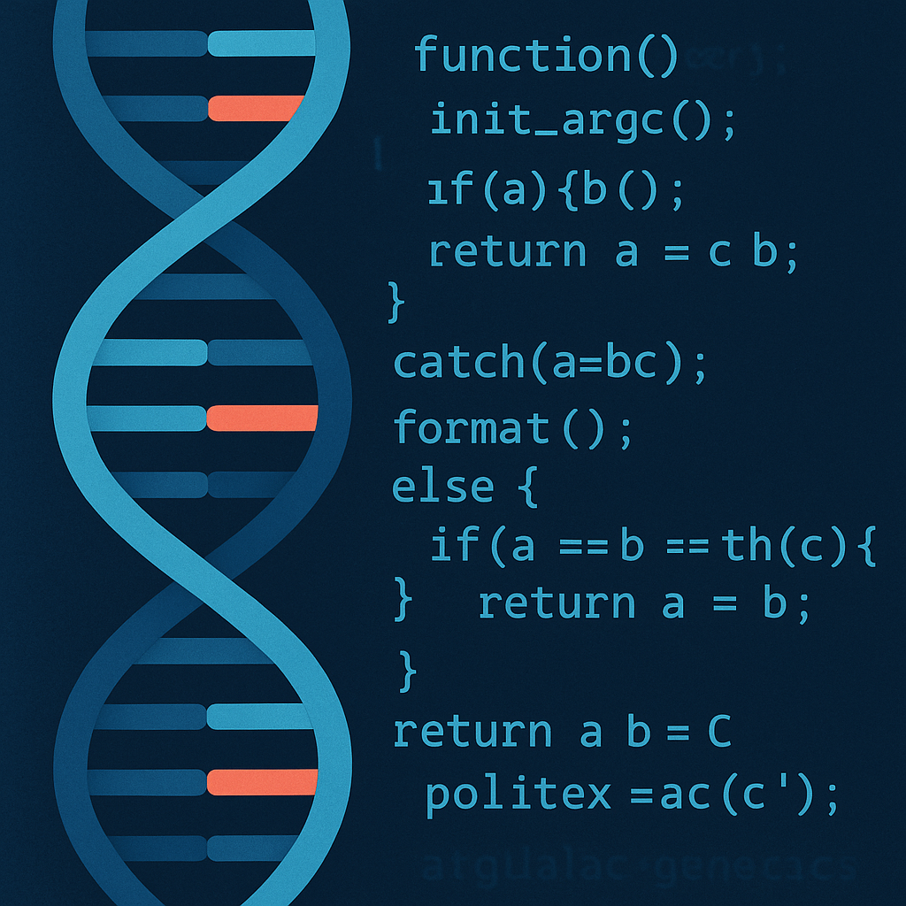

layout: essay
type: essay
title: "Coding Molecules: My Journey Into Biochemical Genetics and Computer Science"
# All dates must be YYYY-MM-DD format!
date: 2025-08-31
published: true
labels:
  - Biochemistry
  - Genetics
  - Computer Science
  - Career Goals
---

*The future of medicine may belong to those who can read both molecules and code.*

## Where It All Started

Back in high school biology, I was amazed that a tiny strand of DNA could explain something as big as eye color—or why someone might get sick. Around the same time, I took a computer science class. At first it was just curiosity, but soon I was hooked. I loved how writing a few lines of code could make a computer do exactly what I wanted.  

For a long time I thought these two interests—biology and coding—were completely separate. One lived under a microscope; the other lived on a laptop screen. It wasn’t until college that I began to see how much they could work together.  

## Falling in Love with Biochemistry

When I chose biochemistry as my major, I wanted to understand the building blocks of life. Classes on molecules, enzymes, and genetics made me feel like I was learning the secret language of the body. I began to realize that medicine is really just one big puzzle made of molecules.  

But even as I was learning all this, I noticed something: these puzzles were too big to solve by hand. That’s when my computer science background started to feel less like a side interest and more like the missing piece.  

## Learning to Speak Code

In my coding classes, I started with the basics: loops, recursion, and algorithms. It felt like learning a new language—one that could take a messy problem and break it into clear, step-by-step instructions.  

It didn’t take long to realize that science and medicine produce massive amounts of messy data. A single genetics test can create more information than any person could ever analyze alone. That’s where coding comes in: it gives us the tools to actually understand what the data means.  

## Research: Bringing the Two Together

By my second year in college, I wanted to bring these two worlds together. I joined a research project that studied tiny, ring-shaped molecules called **azirines**, which may be useful for designing new medicines. My role was to use computer models to predict how these molecules would react. Basically, I asked the computer to “play out” possible reactions so we could see what might happen in real life.  

Later, I worked on a project tracing the family tree of parrotfish. We used genetic data to figure out how different species were related and when they split apart. These projects looked totally different on the surface, but they taught me the same lesson: biology and coding aren’t separate—they’re partners.  

## Seeing the Human Side

Outside of research, I shadowed clinical geneticists. Their job is to take complicated test results and explain them to families in ways that make sense. Watching them reminded me that science is not just about numbers—it’s about people.  

That idea stuck with me. Whether I’m coding or studying molecules, the real point is to help someone live a healthier life.  

## Why I Want to Combine Both

I can’t imagine studying genetics without computers anymore. And I can’t imagine writing code without aiming it at something meaningful. Putting the two together feels natural.  

Imagine a program that instantly matches a patient’s test results with thousands of others from around the world. Or a simple picture that shows exactly where a chemical pathway is breaking down in someone’s body. That’s the kind of work I want to do: making tools that doctors can use to give answers faster and more clearly.  

## Looking Ahead

I know this path will be tough. Becoming a clinical biochemical geneticist means years of study in medicine, chemistry, and lab work. It also means continuing to grow as a programmer. But every step I’ve taken—high school biology, first coding assignments, research in labs, shadowing doctors—has made me more certain.  

My goal is simple: to become someone who understands both molecules and code, and use that knowledge to make genetic medicine better for patients.  

---
