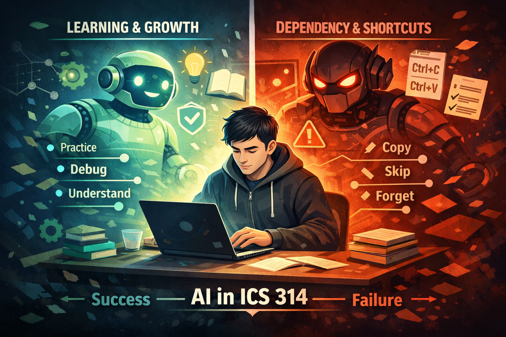

*AI isn’t automatically good or bad—it just amplifies whatever habits you already have.*

## I. Introduction

AI can either be the best tool or the worst tool ever designed, and the difference is not the model itself—it’s the way you interact with it. In education, having instant access to an explanation that can be tuned to *your* level is honestly invaluable. If you are stuck, tired, or just missing one key idea, AI can bridge that gap in seconds and keep you moving. At the same time, it can create real challenges with learning if you start relying on it without actually understanding what it’s doing. In my personal experience, I’ve seen this happen to me and to other people who use AI tools like ChatGPT: the time saved and the “high-quality output” at first is enough to pull you in, and if you’re not careful, that turns into overreliance and laziness instead of struggle, growth, and real comprehension.

In Software Engineering, and specifically in ICS 314, this matters a lot because the course is built around repetition, practice, and applying concepts under pressure. The WOD structure makes it very obvious whether you actually understand something or whether you only understand it when you have unlimited time and unlimited help. AI can accelerate learning way more than ever before if you use it to learn and engage rather than just doing Ctrl+C and Ctrl+V. For this course, the main tools I used were ChatGPT, occasionally GitHub Copilot for small autocomplete-level suggestions, and Bard/Gemini a few times when I wanted a second explanation—especially in moments where ChatGPT felt overconfident or overly complicated for what the course actually needed.

## II. Personal Experience with AI (ICS 314)

### Experience WODs (e.g., E18)

Experience WODs felt like the same WOD pressure but with a slightly different flavor: you still need speed, but you also need accuracy because the task often contains small “gotchas” that punish shallow understanding. The way AI helped me most here was when I treated it like a debugging mirror rather than a solution generator. When I used it that way, it wasn’t “doing the WOD for me,” it was helping me see what I was missing. A typical prompt I used was something like, “Create a practice WOD similar to E18. Focus on the same skills, but change the data and requirements so I can’t memorize the answer,” because I wanted reps without turning practice into a memorization game. When I ran into a bug, I would ask things like, “Here is my code. I’m getting `undefined` when I run it—point out the bug but don’t rewrite the whole solution,” because rewriting the whole thing defeats the point of practice. I also used prompts like, “List 5 edge cases this code might fail on based on the instructions,” because edge cases are usually where the difference shows up between “almost done” and “actually done.”

When AI was useful in experience WODs, it was useful in a very specific way: it helped me practice more and it reduced the amount of time I spent stuck on small mistakes that didn’t teach me anything new. The cost was also specific. If I used AI too early, before I actually attempted to build the solution, it reduced my ability to start from scratch under pressure. And sometimes AI suggested solutions that were generally correct but didn’t match course expectations or style constraints, which can waste time if you follow it blindly instead of using judgment.

### In-class Practice WODs

In-class practice WODs are where AI can either help you build skill or quietly destroy it, depending on whether you’re using it as a tutor or as a shortcut. The best version of AI in practice WODs was micro-help: one concept, one bug, one line, one missing connection. I used prompts like, “Explain this underscore function in one paragraph and give me a tiny example,” because a short explanation plus a small example is usually enough to unlock the next step without stealing the entire solution. If I was stuck at the beginning, I would ask, “Give me a hint for how to start, but don’t write the full solution,” because starting is often the hardest part and also the part where your habits form. When I hit errors I didn’t fully understand, I asked questions like, “What does this error message usually mean in JavaScript?” because learning error patterns is a real skill and it pays off later.

The benefit of using AI this way was that it sped up the feedback loop. Instead of being stuck for twenty minutes on confusion that wasn’t productive, I could get unstuck quickly and keep practicing the core skill. It also helped me practice more overall because my momentum stayed intact. The cost was that it’s easy to “borrow” logic without realizing you borrowed it, especially when an explanation includes a little too much. Even when the AI was correct, it sometimes explained things in a way that was technically right but not intuitive, which can still slow you down—so I had to learn when to stop asking and just go test things myself.

### In-class WODs

In-class WODs are the most high-stress version of the same skillset: tight time constraints, performance pressure, and limited room for mistakes. After enough practice, AI became less of a teacher and more of a panic button for weird edge cases or syntax blanks. I didn’t lean on it heavily here, but when I did, it was usually because my brain was stressed and I needed a minimal reminder, not a full answer. A prompt in that category looked like, “I blanked on the syntax for X—show me the minimal example,” because under time pressure, the difference between remembering and not remembering can be the difference between finishing and failing. For edge-case failures, I used prompts like, “This edge case fails. Why? Here is the input/output,” because sometimes one tiny mismatch can ruin the whole run.

The benefit of AI in that context was speed and recovery. It reduced the chance of losing an entire WOD to one small mistake. The cost, though, is not just academic—it’s personal confidence. If AI becomes the safety net during timed work, you start trusting the tool more than your own thinking. That’s a dangerous habit because software engineering is full of moments where you have to reason under uncertainty, and a constant safety net can quietly remove your need to develop that muscle.

### Essays

For essays, AI was good for a quick scan, grammar cleanup, and structure-level clarity. It could generate a draft too, but that’s exactly where the danger lives. If the AI generates the draft, it can trap you in a false sense of “I wrote this,” when really the voice and authenticity are missing. The way I used AI was more like a revision assistant than a ghostwriter. I used prompts like, “Check this paragraph for grammar and flow, but keep my diction and tone,” because I didn’t want the writing to lose my voice. I asked, “Give me 3 stronger thesis options based on what I already wrote—don’t add new claims I didn’t make,” because the temptation for AI is to invent stronger claims than your evidence supports. I also used prompts like, “Point out where my argument jumps too fast and suggest transitions,” because transitions are often the difference between writing that feels scattered and writing that feels intentional.

The benefit of AI here was that it saved time and made problems visible. It’s easier to fix your writing when someone—or something—shows you exactly where your argument is skipping steps. The cost was that if I let it write too much, the essay started sounding like AI, which is basically the opposite of what a reflection essay should be. AI also has a habit of suggesting claims that sound good but are not grounded in what you wrote, and if you’re not careful, you end up polishing a lie into something that sounds professional.

### Final project

In larger settings like teamwork, AI’s usefulness depends heavily on the people involved, the maturity of the codebase, and how specific the question is. It was really good at producing drafts, but drafts are not the same thing as correct solutions in a living project. Drafts often miss edge cases, ignore conventions, or accidentally break existing behavior. The most useful prompts I used were narrow and defensive, like, “Here’s our current function and the bug we’re seeing. Suggest a minimal fix that doesn’t change the function signature,” because changing signatures in a team project is how you create chaos. I also asked, “Given this React component, how can I refactor it to reduce duplication without changing behavior?” because refactoring is valuable but only if it doesn’t secretly rewrite what the component does. Another prompt I used was, “List likely edge cases for this feature based on the requirements,” because AI is surprisingly decent at brainstorming the kinds of failure modes you forget when you’re focused on making the “happy path” work.

The benefit of AI for the final project was quick understanding and momentum. When I pasted small, focused snippets with context, it could help me see what was wrong faster, and it could help generate test ideas that saved me from future bugs. The cost was that even with specificity, AI sometimes went out of scope and suggested changes that broke other working parts. If I asked it to rewrite an entire file, it tended to overcorrect and “rebuild” things that didn’t need rebuilding, which is basically the worst thing you can do in a project where multiple people depend on stability.

### Learning a concept / tutorial

Using AI to learn a concept is completely dependent on prompting. A weak prompt produces either irrelevant teaching or an overcomplicated explanation that doesn’t match your level, and that can kill curiosity fast. A strong prompt makes AI feel like a personal tutor. I used prompts like, “Teach me this concept like I’m in ICS 314. Use a simple example, then a slightly harder one,” because the staircase approach helps you build understanding instead of just absorbing definitions. I also used prompts like, “Explain this in 5 sentences first, then expand if I ask,” because sometimes you don’t need a lecture—you need a handle. When I was stuck comparing ideas, I asked, “I’m confused about X vs Y—compare them and give one example,” because comparisons are where understanding becomes practical.

The benefit was fast clarity when the explanation was tuned correctly. It helped turn “I’m lost” into “I can try this now,” which is a huge shift. The cost was that bad prompts waste time and can mislead. Even when explanations were correct, sometimes they weren’t usable under pressure, which taught me something important: understanding a concept and being able to *perform* it during a WOD are not the same thing.

### Answering a question in class or in Discord

I didn’t use AI heavily for answering questions in class or in Discord, but I can see how it can be useful for quick clarification, especially when someone is stuck and needs a small push. When I did use it, it was usually because I wanted to communicate clearly without dumping a textbook into the chat. I used prompts like, “Give a short, beginner-friendly explanation I could post in Discord (no jargon),” because the goal in that setting is clarity, not showing off. I also used prompts like, “Explain why this bug happens in plain English, then show a tiny fix,” because people learn faster when they understand the “why” before they memorize the “how.”

The benefit was faster support and clearer wording. The cost was that AI answers can be overengineered, and if you post something too advanced, you can overwhelm the person you’re trying to help. It also still requires judgment about what’s appropriate for the course level and what’s fair to share.

### Asking or answering a smart-question

AI was surprisingly useful for turning vague questions into smart questions, and that matters because software engineering culture rewards questions that include context, constraints, and proof that you tried. I used prompts like, “Turn my question into a smart question with the right technical details included,” and it helped me realize what I was leaving out. I also asked, “What info am I missing that I should include to get help debugging this?” because a lot of the time, the difference between a question that gets ignored and a question that gets solved is whether you included expected output, actual output, and the minimal reproduction.

The benefit was that it reinforced good habits and made my requests more professional. The cost was that if you rely on AI to form the question every time, you don’t develop the skill naturally. In the long run, that means you might still struggle in environments where you can’t lean on a tool to write your questions for you.

### Coding example (e.g., “give an example of using Underscore .pluck”)

I honestly didn’t use AI much for “give me an example” requests. I stayed personally interested in building examples myself because examples are where you can accidentally inherit a solution and stop thinking. When I was tempted to ask, I usually tried the docs or class examples first, and only used AI if I was still confused. The reason is simple: building the example is part of the learning. If the example is gifted too easily, your brain doesn’t build the connection—it just recognizes a pattern and moves on.

### Explaining code

AI was useful for explaining code when I already had the code written. In that situation, it helped surface assumptions and logic paths I might not notice, especially when I was moving fast. I used prompts like, “Explain what this function does and what assumptions it makes,” because assumptions are where bugs hide. I also used prompts like, “Summarize this code and tell me one thing that could go wrong,” because even one identified risk can save you from a future failure.

The benefit was that it helped me verify whether I actually understood what I wrote, and it made it easier to communicate with teammates when I needed to explain what a function was doing. The cost was that AI can sound confident even when it misunderstands intent, and if you trust the explanation blindly, you can end up misunderstanding your own code. That’s a weird feeling—having a tool explain your code in a way that sounds right but isn’t—and it taught me to always verify with tests and actual behavior.

### Writing code

AI was strongest when writing code in small pieces, not entire files. The larger the request, the more likely it is to go out of scope, invent features you didn’t ask for, or “fix” things that weren’t broken. The prompts that worked best were narrow, like, “Write a helper function that does X and match this style with no extra features,” or, “Given this function signature, implement the missing logic but don’t change anything else.” That kind of prompt kept the AI in a lane where it could help without taking over.

The benefit was quick drafts for small functions and a clean starting point when I already knew what I wanted. The cost was that it still missed edge cases and requirements sometimes, and it made it easy to accept code without truly owning the logic. In a course like ICS 314, owning the logic matters because the whole point is to build skill, not just to build output.

### Documenting code

Documentation is one of the cleaner uses of AI because it’s about clarity rather than invention, and it’s easier to verify. I used prompts like, “Write JSDoc comments for this function based on what it currently does, and don’t change the logic,” because I wanted the documentation to match behavior instead of rewriting behavior. I also used prompts like, “Rewrite this comment to be clearer and shorter,” because short comments that actually say something are better than long comments that say nothing.

The benefit was improved maintainability and better handoff in a team setting. The cost was that documentation can become fluffy unless you keep it strict, and if the AI misunderstands what the code does, it can document the wrong behavior. That’s dangerous because future you will trust the documentation and get misled, so verification still matters.

### Quality assurance (e.g., “What’s wrong with this code <code here>” or “Fix the ESLint errors in <code here>”)

Quality assurance is one of the most practical uses because QA questions are naturally well-scoped. There is a concrete error, a failing test, or lint complaints, and you want a concrete fix. I used prompts like, “Here are the ESLint errors—fix them with minimal changes and explain each fix,” because minimal changes preserve stability and explanations preserve learning. I used prompts like, “This test fails only on this case; why; here is the input and output,” because that style forces the tool to stay anchored to reality. I also used prompts like, “Point out the bug and explain it, but don’t rewrite the whole function,” because rewriting the whole function is how you lose track of what you’re actually learning.

The benefit was a massive time savings and faster pattern recognition, especially for common lint issues and repeated JavaScript mistakes. The cost was that it’s easy to accept fixes without learning why they matter, and sometimes the AI “fixes” by silencing warnings rather than improving the code. That taught me a simple rule: if the tool suggests disabling a rule, the first question should be whether the rule was trying to protect you from something real.

### Other uses in ICS 314 not listed

Beyond the obvious categories, I used AI for structure and momentum. I asked for planning help with prompts like, “Given this requirement, list the steps I should implement in order,” because sometimes the hardest part is deciding what order to do things in. I used it for edge-case brainstorming with prompts like, “What are ten edge cases for this input validation,” because brainstorming failures is not always fun, but it’s essential. I also used it as a rubber duck with prompts like, “Ask me questions to help me debug this instead of giving the answer,” because being forced to explain your thinking out loud often reveals the bug.

The benefit of these uses was that they kept my work organized and reduced the amount of time I spent drifting. The cost was the same cost as always: if you treat AI like an oracle instead of a tool, you stop verifying things yourself, and once verification disappears, you’re basically building on vibes.

## III. Impact on Learning and Understanding

AI influenced my learning in a way that was both positive and risky. On the positive side, it boosted my speed and confidence when I used it correctly. It helped me clarify concepts, debug small issues, and generate extra reps for WOD-style practice. It made the “getting unstuck” moments shorter, which kept me practicing instead of spiraling. In a course structured around repeated performance, that matters, because momentum is a real resource.

On the other side, AI creates a temptation to skip the hard part, meaning the part where your brain has to sit in confusion long enough to build the mental model. When I used AI too early, my comprehension got weaker because I never forced myself to struggle through the logic. The best version of AI for my learning was when I attempted the problem first, failed honestly, and then used AI to diagnose what went wrong. In that workflow, AI didn’t replace my thinking; it sharpened it.

## IV. Practical Applications Outside ICS 314

Outside ICS 314, AI tools feel even more “real” because real-world coding is full of documentation, unfamiliar libraries, messy requirements, and constant debugging. In that environment, AI can be effective for speeding up onboarding into a codebase, generating checklists and test ideas, and catching obvious mistakes early. The difference is that in the real world, the work is less about proving you can do something under a timer and more about building something stable that survives contact with users.

In collaborative settings, like group projects or hackathon-style work, the effectiveness depends on discipline. If the team uses AI to accelerate understanding, it can be a serious boost. If the team uses AI to replace understanding, it becomes technical debt waiting to happen. The output might look done, but the foundation is hollow, and the first unexpected edge case will expose it.

## V. Challenges and Opportunities

One of the biggest challenges is that AI can be confidently wrong, and beginners often can’t tell the difference between a correct answer and a convincing answer. Another issue is overengineering. AI likes to build “the perfect solution,” but software engineering is often about building the correct solution within constraints, and constraints are not optional. AI can also “solve” in a way that bypasses the course’s intended skill-building, which is dangerous because it replaces the learning objective with performance theater.

At the same time, there are real opportunities for integrating AI in a healthier way. If AI is treated explicitly as a teaching assistant rather than a cheat engine, it can support concept checks, guided practice, and structured debugging workflows that actually strengthen understanding. There’s also value in teaching students how to prompt responsibly, which includes keeping scope small, asking for minimal changes, demanding explanations, and always validating results through tests and real behavior.

## VI. Comparative Analysis: Traditional vs AI-Enhanced Approaches

Traditional teaching methods like lectures, documentation, practice sets, and office hours build fundamentals and discipline, but they can be slow in the moment when you’re stuck on a small bug at a bad time. AI-enhanced learning improves engagement because feedback is instant, and it can increase retention if you use it as an interactive tutor rather than a vending machine for answers.

The main difference is that traditional methods force you to slow down and think, while AI lets you move fast. Speed is not automatically good. Speed is only good when you are still learning. The best approach, at least for me, is a hybrid: fundamentals and standards from traditional methods, plus AI as a targeted assistant for clarification, debugging, and extra practice that still requires your brain to do the real work.

## VII. Future Considerations

I think AI is going to become a normal part of software engineering education, but the focus should shift from “can you avoid AI” to “can you use AI without losing your skills.” Advancements will make AI more integrated into IDEs and workflows, and that will increase the need for strong judgment. Verification, testing, and understanding will matter even more because the tool will make it easier to generate code that looks right and fails quietly.

The biggest improvement area is teaching responsible use. That means students learning how to scope prompts, how to validate outputs, how to learn from explanations, and how to avoid dependency. The goal is not to ban a powerful tool. The goal is to make sure the tool doesn’t replace the part of education that’s supposed to shape you.

## VIII. Conclusion

My overall reflection is that AI in ICS 314 can be either a huge advantage or a huge trap. It saves time, improves iteration speed, and can accelerate learning, especially for debugging, concept clarification, and extra WOD practice. But it can also create overreliance, weaken comprehension, and reduce authentic problem-solving if it becomes a shortcut instead of a support.

If I had to summarize my recommendation in one sentence, it would be this: integrate AI in a way that encourages learning rather than replacement. Promote small, targeted prompts, require verification, and treat AI like a powerful tool that you control, not something that controls your effort. At the end of the day, the impact of AI isn’t determined by the tool itself. It’s determined by how we choose to interact with it.
