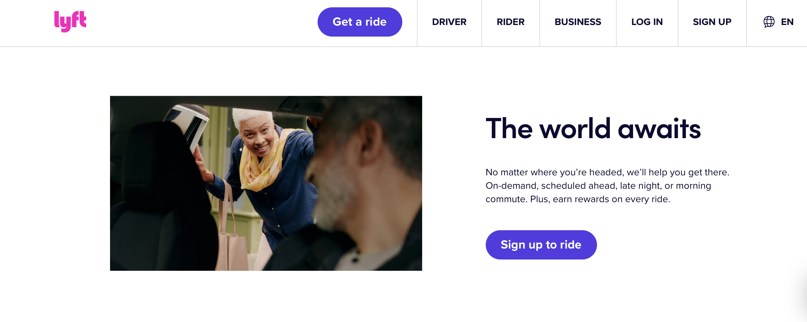

## **The Fellowship of the Grid**

I’m not entirely sure how many people think of software engineers mainly as the ones responsible for website development—but I certainly do. Though it’s my old standing bias, but that’s the image that comes to mind (of course I obviously now fully realize Software Engineering is more than website building). As someone taking software engineering and currently learning HTML and CSS, it’s been enlightening to see just how much more complicated UI development is than I ever imagined.

At first, learning raw HTML felt rough. Everything seemed a little disorganized, and I felt like I needed a clear plan to build what I envisioned. Still, it amazed me how people could take something so plain and turn it into a functional, beautiful website. Then I discovered Bootstrap 5—and honestly, it’s a lifesaver.

## **The Two Containers**

Weird as it sounds, Bootstrap 5 reminds me of coding in Java. Everything feels like one big object on the screen that I can organize and build. Because of how Bootstrap’s grid system works, I’ve found it much easier to structure my layouts and create the foundation of my website than I ever could with plain HTML. Bootstrap 5 is, in a way, a massive time-saver—it gives you so many pre-organized tools and ready-to-use components that let you start coding from scratch without feeling lost. I genuinely believe it helps people bring their mental images to life and turn ideas into something real.

As a beginner, I’m sure I’ve only scratched the surface of what Bootstrap 5 can do. There are so many ways to achieve the same design through different code approaches, which fascinates me. For me, the biggest selling point is that everything you see and interact with on the screen can be manually customized to behave exactly how you want—tailored to your own vision of how users should experience your site.

## **The Return of the Navbar**

But even with all this freedom, HTML can still be tricky. If you don’t have a clear plan or a mental picture of what you’re building, your site can quickly feel incomplete and your code messy. The layout, margins, and spacing can change drastically each time you rework your design. It’s both the beauty and the challenge of front-end development: total freedom, but only if you know where you’re going.

## **The Ride of the Lyft-Kings**

A good example of websites that show they know what they're doing are the ones that feel like even a person who has never interacted with technology before would be able to navigate them perfectly — as if it were second nature, almost instinct. Some of these websites, for instance, can be Spotify or Lyft, or even Vogue, which all use Bootstrap 5 as part of their web development. Spotify’s website feels smooth and natural to move through, with everything laid out so clearly that you never really have to think about what to click next. Lyft has that same kind of flow — it feels intuitive, organized, and responsive no matter what device you’re on. And Vogue, though focused on visuals, still keeps its layout elegant and minimal in a way that feels clean and intentional.

## **There and Back Again: A Bootstrap’s Tale**

I think that’s what makes Lyft’s website so great — it looks good and works beautifully without trying too hard. When you open the front page, it immediately feels simple and natural. The design is super clean: a white background, plenty of open space, and that bright purple “Get a ride” button that instantly draws your attention. Even if someone had never used technology before, they would know where to click — it’s that easy and almost instinctive. The navigation bar is short and straightforward, with options like Driver, Rider, and Business, all lined up neatly without clutter. It feels welcoming, not overwhelming.

The photo right below that — an older woman smiling as she gets into a car — adds warmth and personality. It gives the impression that Lyft isn’t just about transportation but about people connecting. Everything from the clean text to the image placement feels intentional. Maybe it’s wrong or not to say, I’m not a critic, but in my personal opinion Lyft’s website builds a culture around its image — simple, open, and human. The aesthetics are definitely a big part of that. Since design and usability are part of Lyft’s vision, their website naturally follows that same philosophy. Being a college student and someone learning web development, I can’t help but admire how effortless they make it all seem. It feels premium, easy to use, and somehow familiar — almost instinct. Take a look: 

  

## **The Breaking of the Build**

Looking back, I think learning Bootstrap 5 has been kind of like going on an unexpected journey — one that started with total confusion and ended with me realizing that maybe, just maybe, I actually understand what’s going on (at least most of the time). It’s weird, but Bootstrap feels like that one friend who always has everything organized while you’re still trying to find where your files went. It makes the process of building a website less about suffering and more about creativity — about actually seeing what’s in your head appear on screen, without spending three hours aligning one button.

What I’ve learned most is that front-end development isn’t just about getting things to *work*; it’s about making them *feel right*. Like Lyft’s homepage — it’s not flashy, but it flows. It’s confident, clean, and everything just clicks (literally). Bootstrap gives you that kind of power: the ability to make something that not only functions but also looks like it knows what it’s doing.

Sure, sometimes my grids break, and I’ve spent more time than I’d like to admit wondering why my navbar suddenly disappeared into another dimension. But honestly? That’s part of the charm. Every error is just another reminder that good design takes patience — and a lot of debugging.  

At the end of the day, Bootstrap 5 really is “One Framework to Align Them All.”  