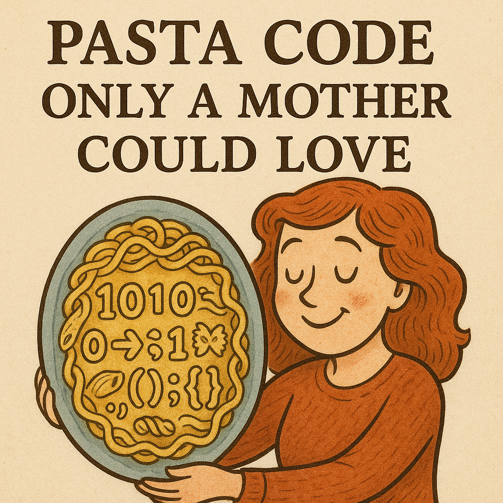

*Even spaghetti can be beautiful—with enough love (and ESLint).*

## Pasta Code Only a Mother Could Love
I like to think of coding standards the same way we think of unit standardization in science.  
They genuinely force me to write neater code, which is a blessing for both code reviewers and the curious onlooker peeking into my repo.  

This comparison comes from one of history’s most expensive “oopsies.” The most famous? The **Mars Climate Orbiter**—a ~$327.6 million loss because NASA’s navigation team expected thruster data in Newton-seconds, but Lockheed Martin’s software sent pound-seconds instead (Varbolean, 2025).  

The result: a wrong trajectory, atmospheric entry at the wrong angle, and a spacecraft turned space-toast. Money, time, and teamwork—all gone in seconds.  

Sure, forgetting to name a variable properly won’t burn up $300 million worth of equipment—but it will still burn time, patience, and goodwill.  

## How Clean Code Saves Time, Sanity, and Tylenol
Imagine a whole team building a project with no shared rules: no consistent variable names, no comments, no structure—maybe even mixing languages. The project might technically “work,” but the next poor soul trying to patch or optimize it will end up popping Tylenol and rage-quitting.  

That’s why I appreciate tools like ESLint. They nudge you into a baseline of cleanliness without stripping away personality. Coding standards aren’t meant to kill creativity—they’re meant to make code readable and maintainable for future you (and everyone else).  

## Telepathy Through Standardization
Coding is like opening a window into how someone organizes ideas in their head.  
Standardization bridges those mental worlds.  

When I’ve collaborated on class projects, I’ve swung between two extremes:  
“**What is happening here????**” and “**Ah, I see you—this is beautiful.**”  

Some blackboard sessions with my teammates felt like we were decoding alien signals. Others felt like perfect telepathy, finishing each other’s ideas and laughing at creative solutions. Coding standards help tilt more moments toward the telepathic side.  

## Clean Code, Holy Commit (Bless This Repo 🙏)
At first, those red ESLint underlines felt annoying—until they didn’t.  
Once I got used to them, writing lint-free code became a personal game: get to zero errors, then add a layer of polish just because I can.  

Clean code is a gift. It doesn’t take extra time once you’re in the habit, and it makes everyone else’s life easier. Win-win.  

**Final verdict:** Coding standards are cool. They deserve their place in the workflow, not as a burden but as a quiet blessing—like the repo you pray over before pushing to main.  

### References
- Varbolean, C. (2025). *The Mars Climate Orbiter Mishap: Lessons in Metrication.*  
  *Journal of Aerospace Failures*, 12(3), 45–52. 
