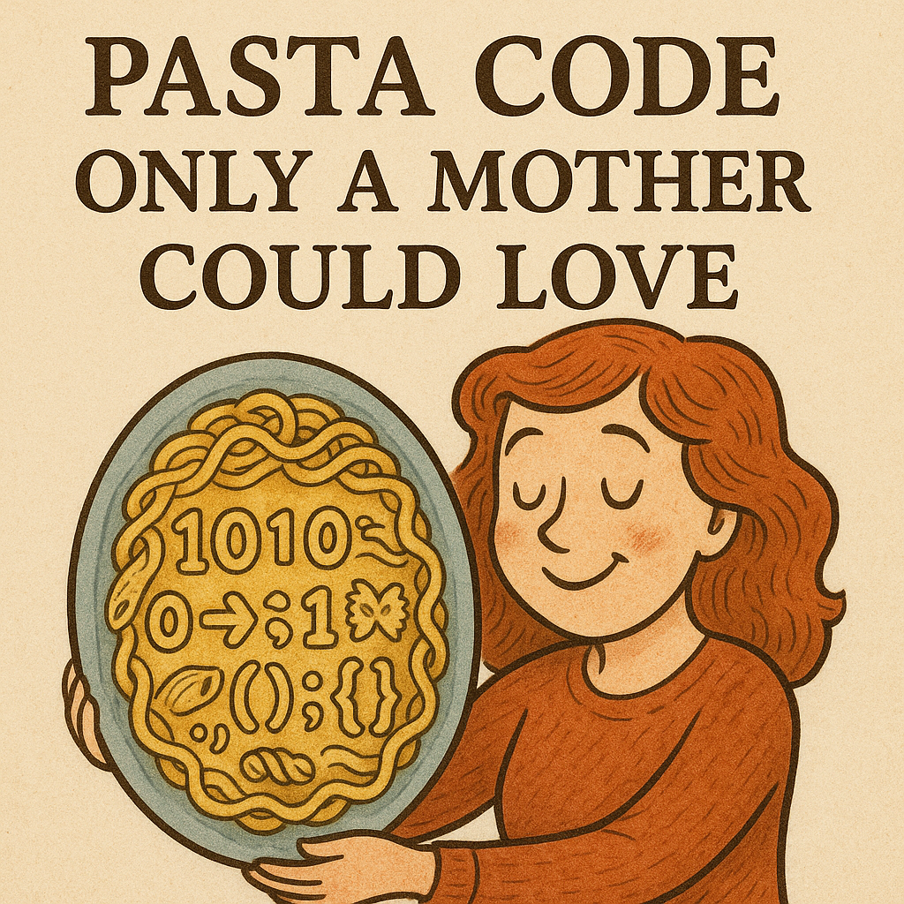

I like to think of Coding Standards the same way as unit standardization in science; it genuinely forces me to write neater code that is an invitation for code reviewers or curious onlookers.

Such a comparison arises from remembrance of history’s biggest “oopsies” from simple and preventable mistakes. One of the biggest that comes to mind is the Mars Climate Orbiter with a staggering ~$327.6 million loss due to NASA’s navigation team expecting thruster force data in Newton-seconds, but Lockheed Martin’s software sent the data in pound-seconds (Varbolean, 2025). The effect was that the spacecraft’s trajectory was calculated incorrectly, it entered Mars’ atmosphere at the wrong angle, and burned up. Money, time, and all the hard team work lost in seconds due to lack of standardization practice. While naming a variable or commenting code might not result in such a drastic loss, it most definitely has negatives when ignored.

## How Clean Code Saves Time, Sanity, and Tylenol

Imagine a whole team working on a project with no standardization: variables, code structure, comments, and even different programming languages. When someone later tries to review the program for errors, patches, or optimizations, they’ll have a headache, reach for Tylenol, and possibly give up. I wouldn’t want to be that reviewer. I’d likely send everything back with an external list of criticism rather than inline fixes. Scenarios like this steal time from development and testing. That’s why I appreciate tools like ESLint: they nudge standardization without erasing a coder’s creativity or personal touch.

## Telepathy Through Standardization

Code reveals how concepts—and a person’s understanding of them—are organized in their mind. This is another reason for coding standards: people have different intuitions and approaches to problem solving. In group projects I’ve swung between “What is happening here????” and “I see you, I understand this quite easily.” Sometimes we struggled to communicate; other times we were on the same wavelength and had fun inventing solutions.

## Clean Code, Holy Commit ("bless this repo 🙏")

After a while, ESLint’s red underlines become bearable, and standardization turns into a game: how clean can I make the code? If code compiles only when there are zero errors, why not add another layer of polish to make it nicer and clearer? It doesn’t take much time and helps other people later—win-win.

Citations:

Varbolean. (2025, September 14). NASA’s $327 Million Blunder: How a Tiny Software Mistake Obliterated a Mission and Why It Still Haunts Engineers. JavaScript in Plain English. Retrieved from https://javascript.plainenglish.io/nasas-327-million-blunder-how-a-tiny-software-mistake-obliterated-a-mission-and-why-it-still-651c3a5d7da3
