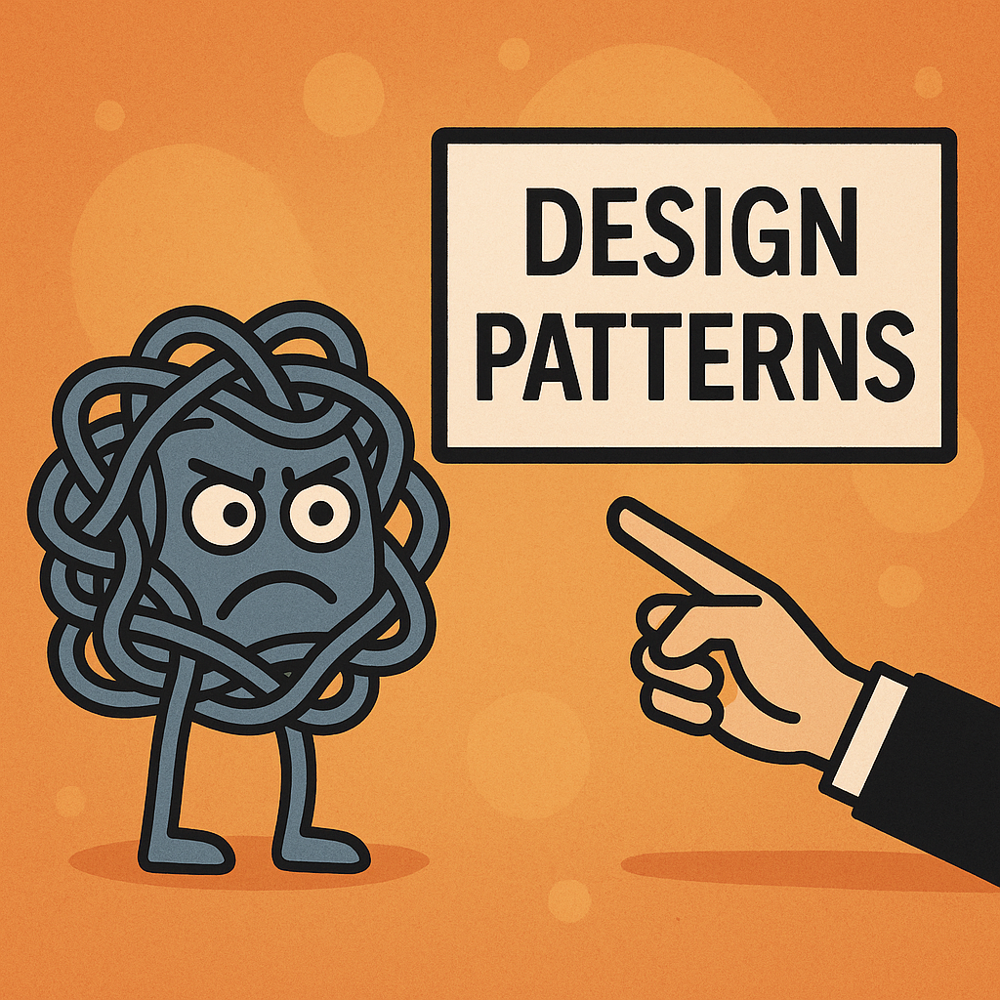

*Design patterns are less about “fancy code” and more about knowing which tool to grab when.*

## The Design Pattern Multiverse

There are many fields within our society: lawyers, doctors, engineers, professors, nonprofit starters. Anyone who does work to benefit society has their field – a role. With many of these roles come principles under which people tend to operate, a sort of baseline for performing their function in our world. Performing a function or getting the job done can be through personal physical involvement, your actions, or through the use of tools and instruments.

Of course, in software engineering, our main instrument and tool is our computers, but layered over that, much of our execution and its performance still comes from our physical actions, such as our approach to the problem. Our individual contribution, and how successful we are at executing a task—or, to be exact, developing the software—can be seen through how we follow a set of design patterns. You can think of design patterns as a general guidebook for “getting the job done,” as they help hone our actions into particular principles.

I like to think of design patterns as a way to reach into a tool bag and grab the tool you need for the job at hand; I think this is just the most universal way of thinking about them, no matter what situation you are in. I mean, in software engineering you have design patterns, but a medical professional might have their own “design patterns” when they follow certain steps in diagnosing and treating specific diseases. I’m very certain lawyers have their own “design patterns” when they look over a case, search for evidence, prepare their argument, and then deliver it.

I think the patterns themselves are universal; it’s just that what we call “design patterns” varies across professions. Of course, while each field might have its own approaches, the tools within those approaches differ, and what they aim to accomplish is not as universal across professions or problems.

Interestingly enough, design patterns within software engineering aren’t necessarily about just sitting down and coding. They’re about taking two steps back in order to know your next ten steps forward. From personal experience—through my own projects and working with a team to deliver a functional website—I’ve seen how true this is because of design patterns.

It’s hard to find a person who wouldn’t want to save time and solve their problems in an easier way, and having a developed methodology for approaching a problem and dissecting it is worth investing your time into, since struggling with problem-solving can slow down the whole journey from start to finish.

In particular, I want to focus on three design patterns that I’ve found to be very useful in my experience, and also highly relevant in most teamwork-based environments. These design patterns are modular design, singletons, and component-based architecture. I focus on these not only because of personal experience, but because I believe the ideas behind these patterns in software engineering can be universally applied to other professions as a way of tailoring problem-solving.

## Modular Design: Teaching Your Code About Boundaries and Job Descriptions

When I think about modular design, I basically think about breaking a huge, overwhelming problem into smaller chunks that actually feel doable. Instead of staring at “the whole website” or “the whole project” and freezing, you split it into modules: login, user profile, payment, whatever it may be across teams into manageable parts. Each module has its own job and each job has an “employee” working it.

For a team, this is huge, because it means different people can own different pieces without stepping on each other’s toes every five minutes. You know where your work starts and ends, and you also know how it plugs into everyone else’s. Outside of software, it’s kind of like a hospital having different departments—cardiology, pediatrics, emergency—each doing its part but still working together to keep the whole place running. Modular design just gives structure to that idea in code. Of course, it comes with its own cons as well, with the biggest one being personal accountability, given the fact that if a part is missing the whole system suffers because of it.  

## Singleton: The Chosen One of Your Codebase

Singletons, to me, feel like that one shared thing everyone goes back to when they need something central. In this sense, a singleton is less about fancy code and more about agreeing on a shared source of truth so you don’t waste time reconciling ten different versions of reality. To give context, this is basically like branching off of the “main” branch on GitHub and using the same database and schema all across the project. This makes things easier, as there is a fundamental true version that gets edited and worked on versus infinitely many “final” versions of the project.

## Component-Based Architecture: Build-a-Bear, but for Web Pages

Component-based architecture is how I make sense of modern web development in my head. You don’t think of a page as one giant blob—you think in pieces: buttons, cards, forms, headers, sidebars. Outside of coding, it’s kind of like using standard parts in manufacturing—you design a few reliable pieces and then assemble them in different ways depending on what you’re building.

Component-based architecture just gives a name to that approach in the world of software. Going back to the screwdriver example, it’s like one of those on-sale Father’s Day presents that advertise a single screwdriver with endless possibilities (extra bonus for the magnetic tip to hold the different screwdriver heads). You invest in good components once, and then you reuse them everywhere, which saves time, keeps things consistent, and gives the whole team a shared set of building blocks to reach for.
