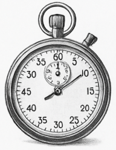

*Estimating isn’t about being right the first time—it’s about building a relationship with reality.*

## Effort Estimates and Historical Basis

I made my effort estimates by basically treating my past work like my own little dataset. The main “historical data” I used was my WOD experience—how long it took me to do everything from writing a single function to building a full page and wiring it up so it actually works. In my head, I grouped tasks into “small,” “medium,” and “this is going to fight back,” and then I estimated based on which bucket it felt like. Of course, it wasn’t perfect, but it was personalized, which mattered more than pretending I had some universal formula.

## Value of Estimating in Advance

Yeah, it still helped—honestly, even when I was wrong. Estimating ahead of time turned the task into something I could play against, kind of like how WODs gamify work: you have a target, and you try to beat it without cutting corners. For example, if I guessed “this should take me 45 minutes,” I approached it with more urgency, like I had a timer running in the background even before I started the actual timer. Even when I went over, I still got a benefit: I stayed more aware of time instead of letting the task sprawl into an all-day fog.

## Usefulness of Tracking Actual Effort

Tracking was useful because it forced me to confront reality instead of vibes. When I saw the actual time, it made patterns obvious—like how “just adding one feature” usually includes hidden steps (debugging, checking edge cases, fixing styling fallout, writing small glue code). It also informs future estimates because now I don’t only remember the coding; I remember the full process. In that sense, tracking becomes the feedback loop that turns estimating from guessing into a skill.

## Tracking Method and Accuracy

I tracked effort by setting a phone timer and letting it run while I worked. If I got distracted or had to step away, I stopped it, because I wanted “work time,” not “life time.” Accuracy-wise, I think it was decent, but not perfect—sometimes I’d forget to pause right away, or I’d keep going during a quick interruption. Still, it was accurate enough to show me the main problem: I wasn’t underestimating because I’m slow at coding; I was underestimating because I wasn’t counting everything around the coding.

## What I’d Change Next Time

Next time I’d estimate non-coding time explicitly, because that’s what sneaks up on me. I’d break the estimate into parts—planning, implementation, debugging, and “polish” (which is usually where I go over). It’s kind of like packing for a trip: the flight isn’t the whole journey, and if you only plan for the flight, you’re going to be confused when you miss everything else.
