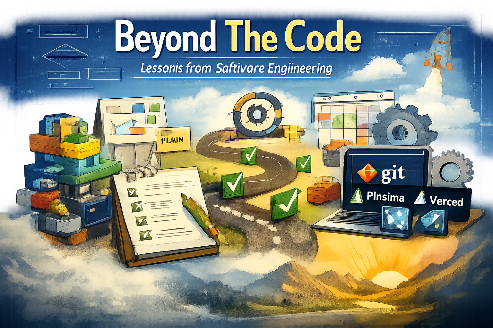

## Systems, Not Just Syntax

### The Great Design

Before I started this course, I thought software engineering was just coding with better habits. Now I believe it’s more about building something that can handle growth rather than just making something run. Systems were the real topic of the course, with web apps being the environment we practiced in. When I say “systems,” I mean the way you plan work, how you organize a project so it doesn’t turn into a mess, and how you deal with complexity when the codebase stops fitting neatly in your brain. The biggest shift for me was realizing that “good engineering” is less about how brilliant the engineer is and more about the decisions that bring relief to your future self.

### Lego But In Code

One of the most valuable things I learned was what intelligent architecture looks like in large-scale projects. In simple terms, intelligent design means splitting a project into independent components—self-contained parts with clear responsibilities—so everything isn’t interwoven. The main danger is dependency, which is when one part of your project can’t be changed without affecting other parts. Tight dependencies create a chain-reaction effect where one small change can trigger a bunch of unexpected breakage, and suddenly you’re debugging something you didn’t even touch. But if the parts are arranged properly, the project can expand without constantly fighting itself. And honestly, that lesson isn’t just for programming. It applies to organizational planning too, because any big plan runs better when responsibilities are clear and parts can move without dragging the whole system with them.

### Mental Maps Before Mental Naps

What I learned the hard way is that pre-planning saves time, even though it doesn’t feel like it should. Pre-planning isn’t just “thinking about it for a moment.” It’s defining what you’re building, what data or pieces you need, and what “done” means before you start writing code. When I skipped that step, coding felt like walking through a fog where I was trying to implement and understand the system at the same time, which almost always leads to confusion. But when I planned first, the work stayed clean because I wasn’t constantly guessing what I was doing mid-stream. It’s the difference between building with intention versus improvising until something works and then hoping it keeps working.

### Managing Management  

I also learned that project management can be a real tool instead of just a buzzword, especially through Agile and Issue Driven Project Management. Agile Project Management is basically a way of working that assumes requirements will change, so you build in smaller pieces, get feedback, and adapt instead of trying to plan everything perfectly from day one. Issue Driven Project Management is a more specific version of that where “issues” are the unit of work—an issue is simply a clearly written task or problem that needs to be handled. I can easily see myself using this outside web apps, because it turns vague stress into concrete steps. Whether it’s a research project, planning an event, or mapping out a long-term academic plan, issues make the work visible, trackable, and way less dependent on memory and vibes.

### Tools Are Your Best Friends

Finally, I learned how to adapt to a real toolchain, and more importantly, what those tools actually do for engineering. Git is version control, meaning it tracks changes over time so you can experiment safely and roll back when something goes wrong. GitHub builds on that by making collaboration and issue tracking more structured instead of chaotic. Prisma helped me understand how tools can make data handling cleaner by letting you define models and interact with a database more safely, while Vercel showed me the importance of configuration management, which is the practice of controlling the settings and environment a project runs in so it works consistently outside your laptop. VSCode tied everything together as the place where the workflow actually happens. The main takeaway is that software engineering isn’t just “make it work”—it’s making it understandable, maintainable, and real.
