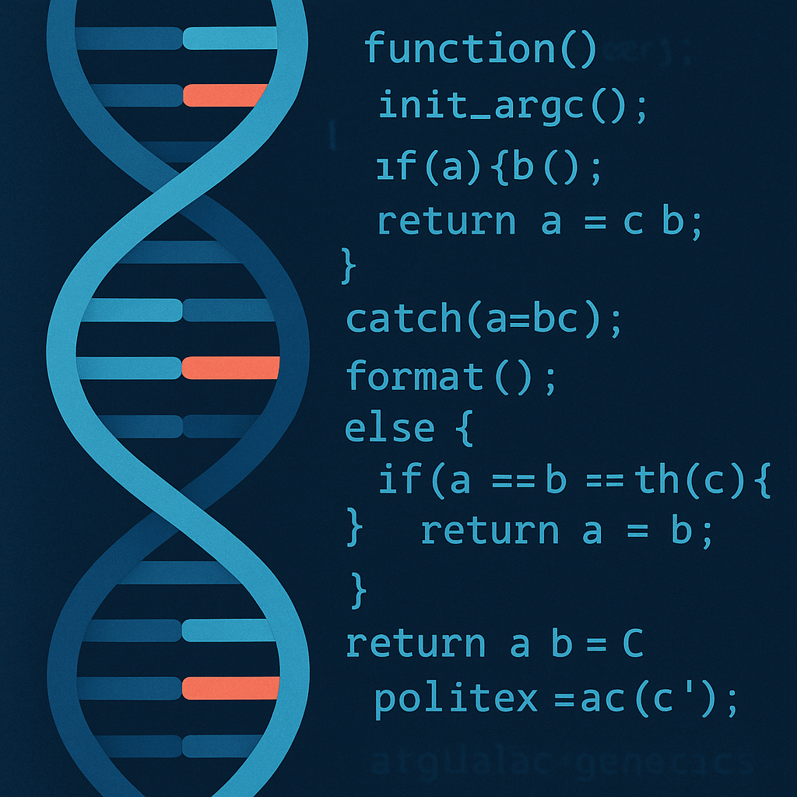

## Typescript, The Evil Twin of Java!!!

After picking up the basics of TypeScript, I’ve realized just how thankful I am for my background in Java. Specifying variables and function return types isn’t new to me, but every new language has its quirks. Having completed much of my earlier computer science coursework in Java, I’m now working on building that same level of confidence in TypeScript. The learning is definitely expedited due to some resemblance of Typescript to Java in its coding approach and rules.

Right now, my main focus is understanding how data structures are created and manipulated in TypeScript to accomplish specific tasks. For example, I have to spend quite a bit of time searching the web just to figure out the important basics, example being how to remove element(s) from an array. My short-term goal is to reach the point where I can comfortably implement more advanced data structures, like Red-Black Trees, and gain the same comfort working with data in this new language that I had in Java.

Coming from Bowdoin College’s Computer Science department—where the emphasis is heavily on the mathematical theory behind algorithms and data structures—TypeScript feels like a learning curve of small exponential growth with tiny but persistent annoyances at times (especially when I learned there’s no .remove() for arrays…. and other cases for other missing built in methods I am used to that are missing or are syntaxed differently).

## Typescript TRIES To Be Unique & Cool...It Kinda Is

Since I’m also learning machine-learning packages in Python, I sometimes feel twisted between two mental models. I’ll leave a TypeScript function open without realizing it, then hop into Python and—without thinking—start jamming in braces that don’t belong there. The flip side happens too: I’ll write indented Python blocks and catch myself expecting TypeScript to be happy without explicit braces and semicolons. Little things pile up—snake_case vs. camelCase, None vs. null/undefined, colons after def vs. curly braces after function—and it all reminds me that my hands are still switching gears.

All that said, TypeScript isn’t hard to pick up; it just asks for time to acclimate to its rules and its programming culture. To me Typescript is similar to Java—not necessarily like with extra steps, just different steps. Classes, interfaces, and generics feel super familiar; however  the differences still show themselves.

## Should We Send Typescript To The Shadow Realm???

Having my first few assessments and problems requiring the manipulations of data structures I can say that Typescript is ok. However I am obviously lacking in Typescript experience and it would be unscientific of me to make any strong statements when I am mentally pulling my opinions from a limited sample size of problems solved using Typescript. Having some built in methods that I am familiar with throws off my planning aspect of how I go about solutions for problems and my feelings towards Typescript in general. However I am really sure that during team collaboration the specifying of data type of function returns and variables is a huge passive boost towards great coding practices in general. Since due to this requirement of Typescript coding larger projects is easier since you can follow code easier. Since communicating code can be challenging. 

Simply summurized, there Typescript will be a place in my heart for it...but currently it is tough love. 

