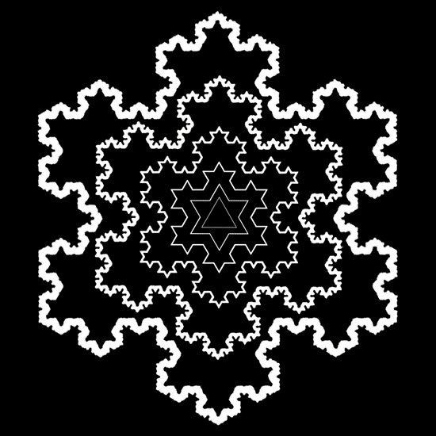

# Koch Snowflake Fractal in Java

This project focused on implementing the Koch Snowflake fractal in Java using recursion and the Swing graphics library. The fractal begins with a simple equilateral triangle, and with each recursive step, the middle third of every line segment is replaced by two new segments that form a triangular peak. This iterative process creates increasingly intricate and self-similar patterns that approximate the famous Koch Snowflake curve. Beyond simply drawing the fractal, the program also includes functionality to calculate the total perimeter using a recursive formula, as well as to print out the generated points for verification and visualization.

My role was to design, implement, and test the full program from scratch. I structured the code around modular helper methods such as linearInterpolation for computing intermediate points, peakEdge for generating triangular peaks using trigonometry, and drawSnowflakeSide for applying the recursive subdivision. This modular approach ensured that the recursive algorithm directly reflected the mathematical definition of the Koch curve, making the implementation both mathematically accurate and readable. I also optimized the perimeter calculation by using a recursive formula rather than explicitly summing all segments, which significantly reduced computational overhead. I was solely responsible for the design, implementation, and debugging of this project.

Through this experience, I gained a deeper appreciation for recursion as both a programming tool and a mathematical concept. I learned how to manage exponential growth in recursive algorithms by balancing clarity with computational efficiency, and I practiced using Java’s Swing and 2D graphics libraries to render recursive structures. More broadly, this project taught me how mathematical theory—like fractals and recursive formulas—can be translated into clear, efficient, and visually engaging code. It reinforced my skills in modular design, recursion, and computational geometry, and showed me how abstract mathematics can become tangible through programming.

Source Code Can Be Found At: https://github.com/ievgen-maker/Ievgen-maker.github.io/tree/main/projects#:~:text=KochTriangleCode.md 

