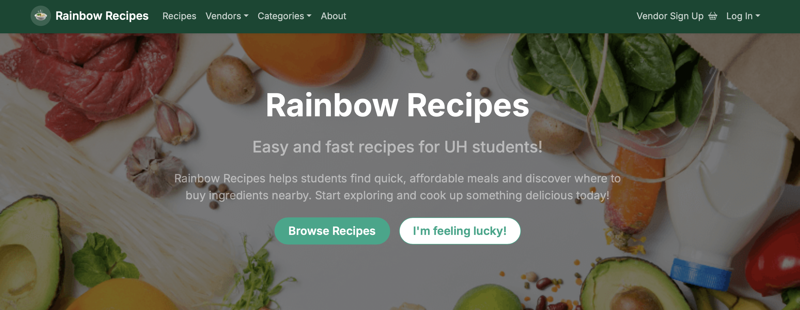
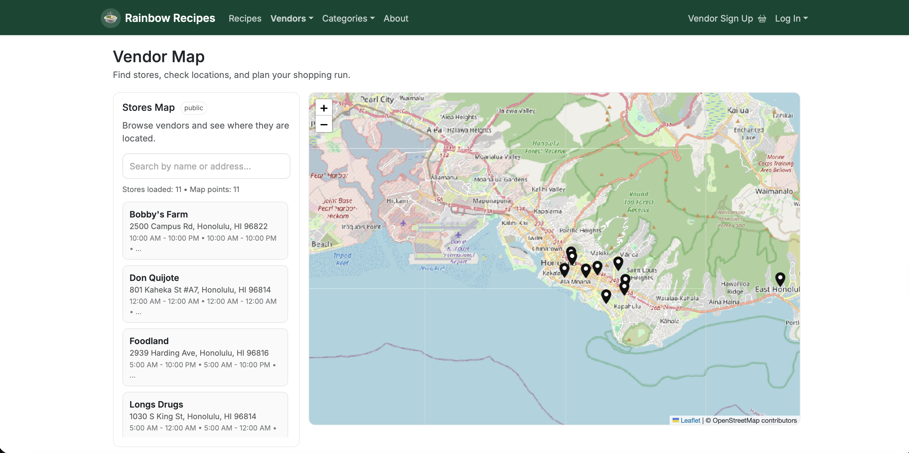
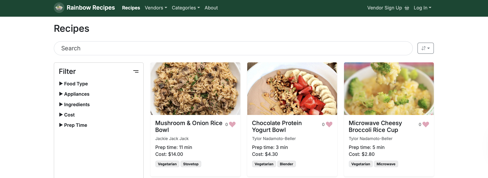

## Overview

Rainbow Recipes is a comprehensive platform built for University of Hawaiʻi students who want quick, affordable, and genuinely good meal options without turning cooking into a second job. Student life comes with tight budgets, limited time, and the constant question of “okay, but where do I even get the ingredients near campus?”—so the whole point of Rainbow Recipes is to bridge that gap. The app lets users browse and save recipes, explore vendor information, and use a vendor map to connect meal planning to real ingredient sourcing around UH. The live site is available at [https://rainbow-recipes.vercel.app](https://rainbow-recipes.vercel.app), and the GitHub organization page is [https://rainbow-recipes.github.io](https://rainbow-recipes.github.io) for anyone who wants the broader project context.

## Contributions

A lot of my contributions were about turning the project from “it technically runs” into something that feels consistent, maintainable, and ready for real users. I designed and implemented the site footer so navigation stayed clean and predictable across pages, because small UI details like that are what make an app feel cohesive instead of stitched together. On the backend side, I worked on database schema creation and management using Prisma, which meant making sure our data model actually matched what the app needed as we added features, and keeping things structured so future changes didn’t turn into a migration nightmare.

I also contributed the vendor map feature, which was one of the most “real life” parts of the app because it connects recipes to actual sourcing around campus, not just hypothetical ingredients. That feature forced me to think about data organization, how vendors should be represented, and how the UI should communicate location-based information without overwhelming the user.

I built out the profile page so users could manage who they are in the system and have one place for their saved content, which made the app feel personal instead of anonymous. That work also pushed me to think about how authentication connects to user-specific data, and how you avoid “ghost data” problems where the UI looks right but the database isn’t actually consistent.

On the reliability side, I wrote Playwright tests so we could catch regressions early and avoid the classic group-project problem of “it worked yesterday and nobody knows why it’s broken today.” I also configured sign-in and sign-out functionality so accounts behaved predictably, sessions didn’t feel random, and user actions actually mapped to the right data. Finally, I helped with team risk management and coordination, which mostly meant identifying what could derail progress (time, overlapping work, merge conflicts, unclear ownership) and pushing the team toward clear responsibilities when schedules got messy during exams and the holidays.

## What I Learned

The biggest lesson for me was that teamwork only really scales when the system itself is built to support teamwork. If the codebase is tangled, even good teammates end up stepping on each other, and progress turns into constant merge conflicts and “who changed this?” conversations. But when the project is divided into independent parts with clear responsibilities, people can move fast in parallel without breaking each other’s work, and the whole thing starts to feel like one machine instead of five separate half-projects.

I also learned how important it is to think in terms of interfaces and contracts instead of “my code vs your code.” Even simple agreements—like what a user object should contain, what a vendor entry looks like, or what a page is allowed to assume about the database—save hours of debugging later. This was where I really understood that planning is not a delay; it’s an investment. When we planned first, implementation felt straightforward. When we didn’t, we paid for it later with rework and confusion.

Tooling was another major takeaway, because it taught me how real projects stay stable outside a single laptop. Git and GitHub stopped being “just submission tools” and became the actual backbone of collaboration, especially when we were working in parallel and needed a clean history of changes. Prisma taught me how much power there is in having a strong, consistent data model instead of letting your database structure drift as features get added. Playwright taught me that automated tests aren’t just for big companies; they’re a survival mechanism when multiple people are pushing changes quickly. And deployment through Vercel made it obvious that “works on my machine” is not a success condition—real software has to run reliably in a real environment, with real configuration, and predictable behavior.

## Links

You can visit the deployed application at [https://rainbow-recipes.vercel.app](https://rainbow-recipes.vercel.app). You can explore the GitHub organization page at [https://rainbow-recipes.github.io](https://rainbow-recipes.github.io). You can view the source code directly in the repository at [https://github.com/rainbow-recipes/rainbow-recipes](https://github.com/rainbow-recipes/rainbow-recipes).
